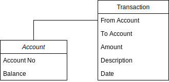

# Money Transfers API

A simple API that simulates money transfers 
between different accounts. The project consists of two main models. The
first, is for managing accounts (CRUD) while the other is for
managing transactions between accounts. 
Next, I will explain a detailed description on folder structure and how
to run and test this project. The following diagram depicts the relationship
between account and transaction.

## Notes: the application is tested only on Linux Ubuntu.

## Table of Content
1. [Money Transfers API](#money-transfers-api)
2. [Main Features](#main-features)
3. [Folder Structure](#folder-structure)
4. [Helper Commands](#helper-commands)

## Main Features

There are some points I want to make sure they are clear:
* I tried to keep simplicity as possible as I can so the objects are not complete.
* Only used the built-in libraries so I built my own mux to be able to add a parametered route.
* No database is used only memory to store objects.
* For thread-safe process I made a lock on balance change to make sure that no dirty-read operations.

## Folder Structure:

* `api/` Contains API methods separated by domain model.
* `cmd/` Here is the main package to start.
* `internal/`
  * `models/` struct for domain models
  * `multiplexer/` instead of importing a third party library I stuck to 
    only use built-in libraries and create my own mux.
  * `services/` domain model services
* `Makefile` commands shortcuts
* `Transfer Money.postman_collection.json` exported Postman collection to
facilitate API testing.

## Helper Commands:

* `make run` to run the API without the need to create an executable file.
  
* `make build` compiles the code and generates an executable file that will
be located in bin directory.
  
* `make test` runs all tests.

* `make curl-add-account` an example of using curl command to add a sample
new account.

